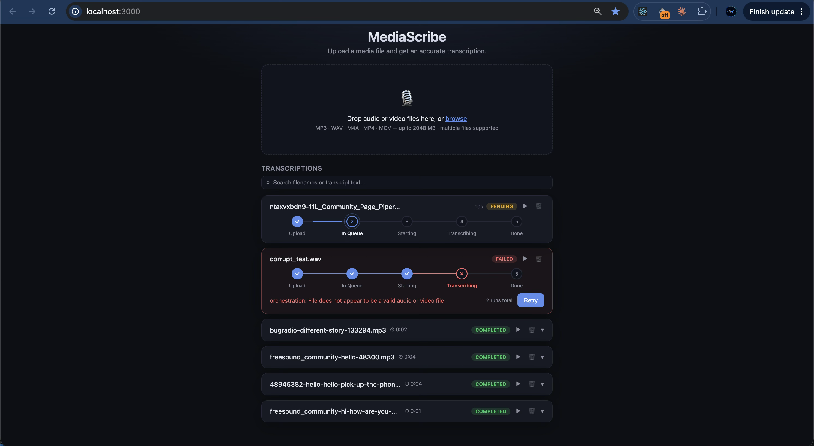
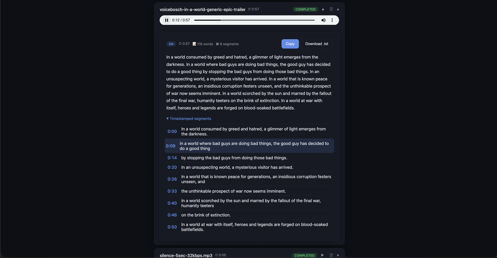
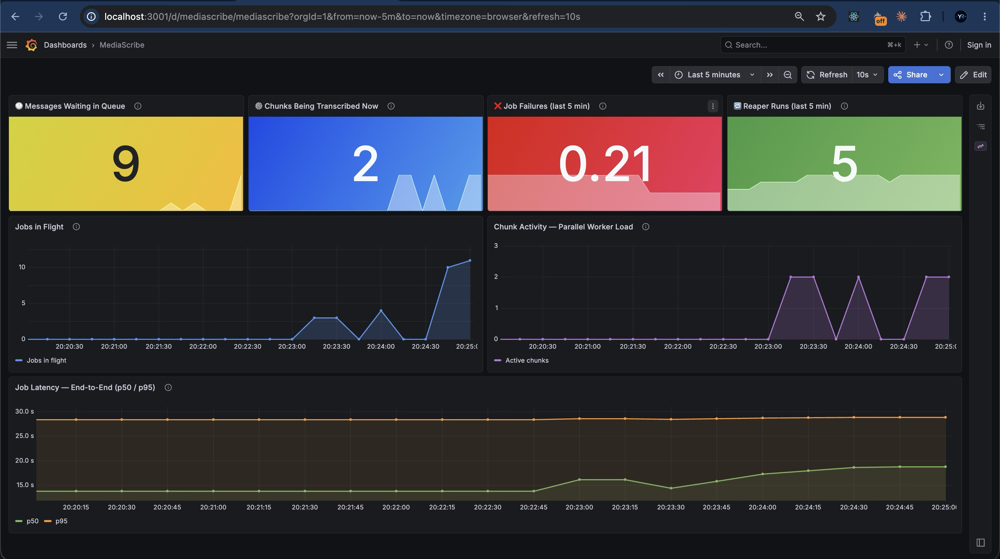

# MediaScribe

An asynchronous, horizontally scalable audio/video transcription service. Drop a
file, get a full transcript with word-level timestamps — powered by
[faster-whisper](https://github.com/SYSTRAN/faster-whisper) (`openai/whisper-small`)
and a parallel chunking pipeline that handles files of any length.

---

## Screenshots

**Job queue** — drag-and-drop upload, live progress stepper, error detail with one-click retry



**Transcript view** — inline audio player, copy to clipboard, download `.txt`, timestamped segments



**Grafana dashboard** — queue depth, chunks in flight, failure rate, pipeline backlog, end-to-end latency (p50/p95)



---

## Table of contents

- [What it does](#what-it-does)
- [Running the Project](#running-the-project)
- [Architecture](#architecture)
- [Why these choices](#why-these-choices)
- [Concurrency model](#concurrency-model)
- [Handling large files](#handling-large-files)
- [Failure handling & resilience](#failure-handling--resilience)
- [API](#api)
- [Configuration](#configuration)
- [Tests](#tests)
- [Observability](#observability)
- [Scope decisions](#scope-decisions)
- [Security & Production Readiness](#security--production-readiness-trade-offs)

---

## What it does

1. A user uploads an audio or video file through the web UI (or the REST API).
2. The API streams it to storage, deduplicates by content hash, creates a job,
   and returns immediately with `202 Accepted` and a `job_id`.
3. A Celery worker picks up the job, normalizes the audio with `ffmpeg`, splits
   long recordings into overlapping chunks, and transcribes them **in parallel**.
4. The chunks are stitched back onto a single global timeline. The UI polls
   progress and displays the full transcript — with playback, copy, and download —
   as soon as the job completes.

Failures are surfaced with an error message and a **Retry** button. Retrying
re-enqueues the job without re-uploading the file.

**Failure model:** If a worker dies mid-chunk, `acks_late` + `reject_on_worker_lost`
re-queues the task automatically. The stitch step uses an atomic MongoDB claim so
only one worker ever writes the final transcript, regardless of how many chunks
complete concurrently. A Celery Beat reaper marks jobs that stop heartbeating as
failed within `STUCK_JOB_TIMEOUT_SECONDS` (default 600 s). All state transitions
are idempotent — concurrent failures on the same job produce exactly one FAILED
event.

**Testing:** 76 unit and integration tests run with no external services (MongoDB
is replaced by mongomock; transcription by a deterministic FakeTranscriber). This
means the entire test suite runs in seconds, in CI, on any machine, without a GPU.

---

## Running the Project

Follow this guide to get MediaScribe up and running on your machine.

---

### 1. Prerequisites (What to Install)

Before running the project, make sure you have the following installed on your computer:

#### 🐳 Docker & Docker Compose (Recommended)
The easiest way to run the entire stack (Frontend, Backend API, Worker, MongoDB, RabbitMQ) is using Docker.
- **Docker Desktop**: Download and install it for your operating system:
  - [Docker Desktop for macOS](https://docs.docs.com/desktop/install/mac-install/) (Supports both Intel and Apple Silicon chips)
  - [Docker Desktop for Windows](https://docs.docs.com/desktop/install/windows-install/) (Ensure WSL 2 is enabled)
  - [Docker Desktop for Linux](https://docs.docs.com/desktop/install/linux-install/)

> [!NOTE]
> Make sure **Docker Desktop is open and running** in the background before executing any commands.

#### 🛠️ For Local Development (Without Docker - Optional)
If you want to run or test the services locally without Docker:
- **Python (3.10+)**: Required for running the backend API and worker locally. [Download Python](https://www.python.org/downloads/)
- **Node.js (18+)**: Required for running the React frontend. [Download Node.js](https://nodejs.org/)
- **FFmpeg**: Required for audio processing.
  - **macOS**: `brew install ffmpeg`
  - **Windows**: `choco install ffmpeg` or download binaries from [FFmpeg.org](https://ffmpeg.org/download.html)
  - **Linux**: `sudo apt install ffmpeg`

---

### 2. Getting Started (Step-by-Step)

#### Step A: Clone the Repository
If you haven't already, clone this repository and navigate to its root directory:
```bash
git clone https://github.com/yuvalr55/MediaScribe.git
cd MediaScribe
```

#### Step B: Set Up Environment Variables
Copy the example environment configuration file to create your active `.env` file:
```bash
cp backend/.env.example backend/.env
```

> [!TIP]
> **To run without downloading the large transcription model (~500 MB):**
> Open the newly created `backend/.env` and change `TRANSCRIBER=whisper` to `TRANSCRIBER=fake`. This uses a fast mock transcriber for testing.

#### Step C: Start the Stack using Docker
Run the following command in your terminal:
```bash
docker compose up --build
```
This command builds the frontend and backend Docker containers and downloads the official MongoDB and RabbitMQ images.
It starts the full stack: API, worker, Celery beat scheduler, frontend, MongoDB, RabbitMQ, Prometheus, and Grafana.

---

### 3. Application URLs

Transcription can take seconds to minutes, so uploads return immediately (HTTP 202) while a Celery worker handles the work asynchronously — this is the minimum viable design for handling concurrent uploads without blocking or timing out. RabbitMQ is the task queue; MongoDB is the single source of truth for job state; Prometheus + Grafana are the production observability layer (bonus, not required to use the app).

| Service | Description | URL | Credentials / Notes |
| :--- | :--- | :--- | :--- |
| **Web UI** | The main application interface | [http://localhost:3000](http://localhost:3000) | No login required |
| **API Swagger** | Interactive API documentation | [http://localhost:8000/docs](http://localhost:8000/docs) | Explore and test API endpoints |
| **RabbitMQ Admin** | Message broker management | [http://localhost:15672](http://localhost:15672) | Username: `guest` / Password: `guest` |
| **Grafana** *(bonus)* | Live metrics dashboard | [http://localhost:3001](http://localhost:3001) | Anonymous admin, no login required |
| **Prometheus** *(bonus)* | Raw metrics & query explorer | [http://localhost:9090](http://localhost:9090) | No login required |

---

### 4. Quick API Smoke Test

To verify the backend API is working from the command line:

```bash
# 1. Upload a media file (replace 'sample.mp3' with your file path)
curl -F "file=@sample.mp3" http://localhost:8000/jobs
# Expected Output: {"job_id":"<YOUR_JOB_ID>","status":"PENDING","deduplicated":false}

# 2. Check the job status (replace <job_id> with the ID returned above)
curl http://localhost:8000/jobs/<job_id>

# 3. Fetch the transcript (once the job status changes to COMPLETED)
curl http://localhost:8000/jobs/<job_id>/result
```

> [!TIP]
> The Grafana dashboard at [http://localhost:3001](http://localhost:3001) shows live pipeline activity as soon as you upload a file — queue depth, chunks in flight, latency, and throughput update every 10 seconds.

---

## Architecture

```
┌──────────┐  POST /jobs   ┌──────────┐   publish    ┌──────────┐
│ React UI │ ───file────▶  │ FastAPI  │ ───task────▶ │ RabbitMQ │
│  (nginx) │ ◀─202 job_id─ │ (async)  │              └────┬─────┘
└────┬─────┘               └────┬─────┘                   │ consume
     │ GET /jobs?active=true    │ write/read         ┌────▼─────┐
     │ (slim polling)           ▼                    │  Celery  │
     │                    ┌──────────┐  read/write   │  Worker  │
     └───────────────────▶│ MongoDB  │◀──────────────│ (prefork │
                          │  (jobs)  │               │ +Whisper)│
                          └────▲─────┘               └────▲─────┘
                               │ stale-job scan           │ scheduled task
                          ┌────┴─────┐   publish     ┌────┴─────┐
                          │  Celery  │ ────────────▶ │ RabbitMQ │
                          │   Beat   │ reap_stuck    │          │
                          └──────────┘               └──────────┘

Worker pipeline:
  orchestrate_job ── ffmpeg probe/normalize ── plan chunks ──┐
       transcribe_chunk × N  (parallel, retried) ────────────┤
       stitch_results ◀── atomic MongoDB claim (last chunk) ──┘

Maintenance pipeline:
  celery beat ── every STUCK_JOB_REAPER_INTERVAL_SECONDS ──▶ reap_stuck_jobs
       └── worker marks stale PROCESSING jobs as FAILED after STUCK_JOB_TIMEOUT_SECONDS
```

**Stack:** FastAPI · Celery · RabbitMQ · MongoDB (Beanie) · faster-whisper
(`openai/whisper-small` via CTranslate2) · React + Vite · nginx ·
Docker Compose · Prometheus + Grafana

### Project layout

```
backend/app/
  config.py              # all settings, sourced from .env (Pydantic BaseSettings)
  core/                  # logging, correlation IDs, exception types, Prometheus metrics
  domain/                # enums, Beanie documents, API schemas (DTOs)
  api/                   # FastAPI routes, dependencies, middleware
    db/                  # Motor + Beanie initialisation
    routes/              # HTTP endpoints
    services/            # API business logic (HTTP-facing job service)
  storage/               # StorageBackend protocol + local filesystem impl (S3-ready)
  worker/
    tasks.py             # stable Celery task names and task-level limits
    orchestration.py     # probe media, plan chunks, dispatch fan-out
    chunk_transcription.py # extract windows and run the Hugging Face model
    stitching.py         # merge chunk transcripts and persist final language/text
    reaper.py            # beat-scheduled stuck-job maintenance
    services/            # ffmpeg, chunking, stitch, transcriber implementations
frontend/
  src/components/        # React UI pieces
  src/hooks/             # polling, search, pagination state
  src/styles/            # CSS split by responsibility
observability/           # Prometheus config, alert rules, Grafana dashboard provisioning
```

---

## Why these choices

- **Async API + queue/worker, not synchronous request/response.** Transcription
  takes seconds to minutes; doing it inside the HTTP request would block and time
  out. The upload returns immediately and work happens out of band — the minimum
  viable design for handling concurrent uploads without dropping requests under load.

- **faster-whisper over `transformers.pipeline`.** `faster-whisper` is the
  CTranslate2-optimised port of OpenAI Whisper. It downloads the same
  `openai/whisper-*` weights from Hugging Face Hub and converts them once at first
  run. On CPU it is 3–4× faster than the `transformers` pipeline at identical
  accuracy, due to int8 quantization and CTranslate2's optimised runtime.

- **Chunking long files instead of feeding them whole to Whisper.** Whisper was
  trained on 30-second windows. Feeding it a 60-minute recording directly produces
  degraded accuracy and can exhaust memory. The pipeline solves this by splitting
  audio into overlapping segments and transcribing them in parallel:

  1. **VAD chunking (`VadChunker`)** — `ffmpeg` detects silence points in the
     recording. Chunks are cut at silence boundaries so words are never split
     mid-utterance. This is the default strategy.
  2. **Fixed-window fallback (`FixedWindowChunker`)** — if no silence is found
     (e.g. continuous speech), the file is split at fixed intervals with a
     configurable overlap so context at boundaries is not lost.
  3. **Parallel transcription** — each chunk becomes an independent Celery task,
     so a 4-worker pool transcribes four chunks simultaneously.
  4. **Stitching** — per-chunk timestamps are shifted onto the global timeline and
     overlapping segments are deduplicated before the final transcript is assembled.

  The result: accurate transcription of files of any length with constant peak
  memory (one chunk at a time per worker) and near-linear throughput scaling.

  > **Note:** `faster-whisper` can chunk long audio internally, so application-level
  > chunking is not strictly required for correctness. The explicit chunking layer
  > is a deliberate design choice: it enables true parallelism across Celery workers
  > (vs. one worker processing one file sequentially), per-chunk retries without
  > re-transcribing the whole file, and chunk-level visibility in the metrics
  > dashboard. For a single-user or low-volume use case, letting faster-whisper
  > handle chunking internally would be simpler and equally correct.

- **Generic interfaces behind `Protocol`s.** `StorageBackend`, `Transcriber`, and
  `ChunkingStrategy` are thin protocols. Swapping the model (`whisper-small` →
  `large-v3`), storage (local → S3), or chunking strategy is a config/impl change,
  not a rewrite. The same interfaces make the test suite fast — no GPU, no broker,
  no network.

- **MongoDB as the single source of truth.** A job and all its chunks are a natural
  document. We deliberately do **not** use a Celery result backend, avoiding two
  competing sources of truth and the split-brain risk that comes with them.

- **Celery beat for scheduled maintenance.** `beat` acts like a small cron
  scheduler for Celery. It does not run Whisper and does not process uploads; it
  periodically publishes `reap_stuck_jobs`, which the worker consumes to fail stale
  `PROCESSING` jobs whose `updated_at` heartbeat stopped advancing.

- **`try_claim_stitch` instead of a Celery chord.** An atomic MongoDB
  `findAndModify` sets `stitch_claimed = true` only when every chunk is `COMPLETED`
  and the flag is not yet set. Exactly one stitch fires regardless of which worker
  process finishes last — no result backend required.

- **Slim polling payload.** The UI mount call fetches full job objects; subsequent
  ticks hit `GET /jobs?active=true` and receive a seven-field slim response
  (`JobProgressResponse`) instead of the eleven-field full schema. Jobs that
  disappear from the active list (transitions to terminal state) are fetched
  individually with `Promise.allSettled`, so a single 404 never blocks the others.

- **All configuration from `.env`** via Pydantic `BaseSettings`. Nothing reads the
  environment directly except `config.py`.

---

## Concurrency model

The guiding rule: **asyncio for I/O, processes for CPU.**

| Component | Model | Why |
|-----------|-------|-----|
| FastAPI API | asyncio (Motor, streaming) | Pure I/O; one event loop serves many requests |
| Uvicorn | multi-process (`WEB_CONCURRENCY`) | Multiple cores for I/O concurrency |
| Celery worker | prefork (`CELERY_CONCURRENCY` processes) | CPU-bound transcription; each process owns a Whisper model |
| Celery beat | single scheduler process | Publishes periodic maintenance tasks; it does not transcribe |
| Transcription | synchronous (by design) | CPU-bound; gains nothing from async |
| Chunk fan-out | Celery `group` | Chunks transcribed in parallel across worker processes |

Uploads are streamed in 1 MiB chunks (`async`, bounded reads) so a multi-gigabyte
file never sits in memory and never blocks the event loop.

---

## Handling large files

Two separate concerns:

1. **Upload** — streamed to storage in 1 MiB blocks while its SHA-256 is computed
   incrementally. The size cap is enforced mid-stream, rejecting oversize uploads
   early with `413`. Memory usage is constant regardless of file size.

2. **Processing** — `ffmpeg` normalises any container/codec to 16 kHz mono WAV.
   Files shorter than `CHUNK_THRESHOLD_SECONDS` are transcribed as a single task.
   Longer files are split at detected silence points (`VadChunker`) — or at fixed
   windows with overlap (`FixedWindowChunker`) if no silence is found — and each
   chunk is transcribed in parallel. The stitch step shifts per-chunk timestamps
   onto the global timeline and removes duplicated overlap.

---

## Failure handling & resilience

| Failure | Mechanism |
|---------|-----------|
| Transient error in a chunk | Celery retry with exponential backoff |
| Permanent error after retries | Fail-fast: whole job → `FAILED` with chunk index and reason |
| Worker crashes mid-task | `acks_late=True` → RabbitMQ redelivers to another worker |
| Job stuck in `PROCESSING` | Stuck-job reaper (Celery beat) fails stale heartbeats |
| Beat scheduler restart burst | `expires` set on the reaper task — missed runs are discarded instead of replayed all at once |
| Poison message (always crashes) | Job is marked `FAILED`; no broker DLQ is configured |
| User re-runs a failure | `POST /jobs/{id}/retry` re-enqueues without re-uploading |
| Late chunk after job already `FAILED` | `save_chunk_result` / `try_claim_stitch` filter on `status != FAILED` — discarded silently |
| Task hangs (CPU spike / model freeze) | `soft_time_limit` raises `SoftTimeLimitExceeded` → mark `FAILED`; `time_limit` is a hard SIGKILL fallback |

Every state transition is persisted with a timestamp. Failures always carry an
`error` string surfaced directly in the UI.

The stuck-job reaper is split across two services: `beat` schedules
`reap_stuck_jobs` every `STUCK_JOB_REAPER_INTERVAL_SECONDS`, and the regular
worker executes it. The task scans MongoDB for jobs still in `PROCESSING` whose
`updated_at` is older than `STUCK_JOB_TIMEOUT_SECONDS`, then marks them `FAILED`
so they disappear from active polling and can be retried.

---

---

## API

| Method | Path | Description |
|--------|------|-------------|
| `POST` | `/jobs` | Upload media → `202` + `job_id` |
| `GET` | `/jobs` | List recent jobs (slim active-only with `?active=true`) |
| `GET` | `/jobs/{id}` | Full status + progress (`0.0`–`1.0`) |
| `GET` | `/jobs/{id}/result` | Transcript + segments (`409` until `COMPLETED`) |
| `POST` | `/jobs/{id}/retry` | Re-run a `FAILED` job |
| `GET` | `/health`, `/ready` | Liveness / readiness probes |
| `GET` | `/metrics` | Prometheus metrics endpoint |

All errors use a consistent shape: `{"error": {"code", "message", "details"}}`.

---

## Configuration

Every tunable lives in [`backend/.env.example`](backend/.env.example) and is read
by `backend/app/config.py`. Key settings:

| Variable | Default | Description |
|----------|---------|-------------|
| `WHISPER_MODEL` | `openai/whisper-small` | HuggingFace model ID |
| `WHISPER_DEVICE` | `cpu` | `cpu` or `cuda` |
| `WHISPER_LANGUAGE` | unset | Force language (`he`, `en`, etc.); omit to auto-detect |
| `API_AUTH_TOKEN` | unset | Optional API key; when set, clients must send `X-API-Key` |
| `VITE_API_AUTH_TOKEN` | unset | Frontend build-time mirror of `API_AUTH_TOKEN` when auth is enabled |
| `CHUNK_THRESHOLD_SECONDS` | `60` | Files shorter than this skip the fan-out |
| `CHUNK_LENGTH_SECONDS` | `30` | Target chunk size for long files |
| `CHUNK_OVERLAP_SECONDS` | `1` | Overlap between chunks (avoids cut words) |
| `MAX_UPLOAD_BYTES` | `2147483648` | 2 GB upload limit |
| `CELERY_CONCURRENCY` | `2` | Worker processes (each holds a Whisper model) |
| `WEB_CONCURRENCY` | `2` | Uvicorn API processes |
| `CELERY_MAX_RETRIES` | `3` | Max retries per chunk |
| `STUCK_JOB_TIMEOUT_SECONDS` | `600` | Reaper threshold for stale jobs |
| `STUCK_JOB_REAPER_INTERVAL_SECONDS` | `60` | How often Celery beat schedules the reaper |

When using Docker Compose with `API_AUTH_TOKEN`, remember that Vite embeds
`VITE_*` values at frontend build time. Set the same token in the shell or root
Compose env before running `docker compose up --build`, for example:

```bash
API_AUTH_TOKEN=change-me docker compose up --build
```

---

## Tests

The suite runs with **no external services**: MongoDB is replaced by
`mongomock-motor` and transcription by a deterministic `FakeTranscriber`
(`TRANSCRIBER=fake`). No GPU, no model download, no broker.

```bash
cd backend
python -m venv .venv && source .venv/bin/activate
pip install ".[dev]"
pytest            # unit + service + API + worker tests, with coverage
ruff check app tests
mypy app
```

Coverage includes: chunk planning and overlap, timestamp stitching, streaming
upload with dedup and size validation, every HTTP endpoint, worker state
transitions, and the stuck-job reaper.

---

## Observability

Prometheus and Grafana start automatically with the rest of the stack:

```bash
docker compose up --build
```

| Service | URL |
|---------|-----|
| Prometheus | http://localhost:9090 |
| Grafana | http://localhost:3001 (anonymous admin) |

The MediaScribe dashboard is provisioned automatically. Each panel has an inline description (hover `ⓘ`). Summary:

| Panel | What it shows | Healthy signal |
|-------|--------------|----------------|
| Messages Waiting in Queue | RabbitMQ messages ready to be picked up | 0 or brief spikes |
| Chunks Being Transcribed Now | Whisper tasks running across all worker processes | Spikes up during jobs, returns to 0 |
| Job Failures (last 5 min) | Failure rate per minute over a 5-minute window | 0.00 (green) |
| Reaper Runs (last 5 min) | Beat scheduler heartbeat — stuck-job scan is alive | ≥ 1 (green) |
| Jobs in Flight | Jobs currently being processed by the worker (live Gauge) | Brief rises that fall back to 0 |
| Job Latency — End-to-End (p50/p95) | Time from upload to completed transcript | p50 and p95 stable and close together |
| Chunk Activity — Parallel Worker Load | How many chunks are being transcribed in parallel | Spikes proportional to file length |

Business metrics are always available at `/metrics` (API) and `:9100/metrics`
(worker, multiprocess-aggregated via `prometheus_client`). Alerting rules for
queue backlog, worker idle, elevated failure rate, stale reaper execution, and
metrics endpoint down are defined in `observability/alerts.yml`.

---

## Scope decisions

These are explicit trade-offs, not oversights.

- **Optional API-key authentication.** Local development runs without auth by
  default. Setting `API_AUTH_TOKEN` makes every `/jobs` endpoint require
  `X-API-Key`; the frontend can be built with `VITE_API_AUTH_TOKEN` for the same
  token. A real multi-user deployment should still replace this with user-scoped
  auth (JWT/session) and per-user job ownership.

- **Local filesystem storage instead of S3.** The `StorageBackend` protocol is
  thin; the local implementation is ~50 lines. An S3 implementation slots in behind
  the same interface. Content-addressed keys and hash-based dedup are already
  correct for either backend.

- **`openai/whisper-small` on CPU.** Balances accuracy and speed without a GPU.
  `WHISPER_MODEL` and `WHISPER_DEVICE` allow switching to `large-v3` on CUDA
  without code changes.

- **VAD chunking as the default.** `VadChunker` (silence-snapped boundaries) is
  the production default; `FixedWindowChunker` (fixed windows with overlap) is the
  fallback when no silence points are detected.

- **Fail-fast on permanent chunk failure.** A single unrecoverable chunk fails the
  whole job. Partial transcripts are harder to reason about and harder for a
  consumer to handle correctly. The failing chunk index is recorded so a retry
  targets only the affected work.

- **No RabbitMQ dead-letter queue.** Permanent task failures are persisted on the
  MongoDB job document and surfaced in the UI with a manual retry action. A
  broker-level DLQ would be useful in production for operator triage, but it would
  be redundant for the user-facing retry flow in this assignment.

- **No client-side resumable uploads** (tus protocol). Server-side streaming
  handles the assignment scope. Resumable uploads are the right call for files over
  ~500 MB on unreliable connections.

- **No retention/cleanup policy for completed media.** The app has a scheduled
  stuck-job reaper for active `PROCESSING` jobs, but it does not delete old
  completed/failed jobs or media files. In production: object storage TTL or a
  scheduled cleanup task keyed on `created_at`.

---

## Security & Production Readiness (Trade-offs)

For the purpose of this home assignment, several security and production concerns were simplified to ensure **zero-friction local execution** for the reviewer. In a real-world production deployment, we would apply the following enhancements:

- **Strict CORS Policy**: The API currently defaults to wildcard CORS (`CORS_ALLOW_ORIGINS=["*"]`) for local development. In production, this should be restricted to the specific trusted frontend domain.
- **Stronger media validation**: Uploads are currently screened by content type, extension fallback for generic `application/octet-stream`, and `ffprobe` during worker processing. For public deployments, add pre-queue magic-byte/container validation to reject bad files before storing/enqueueing them.
- **Secure Container Execution**: Backend containers run as an unprivileged `appuser`, and the frontend uses an unprivileged nginx image. Production deployments should still add read-only filesystems, dropped capabilities, and stricter runtime profiles.
- **Database & Broker Isolation**: Database and message broker ports (`27017`, `5672`, `15672`) are exposed on localhost to allow easy development debugging. In production, these ports would not be exposed to the host machine and communication would be isolated inside a private subnet / virtual private cloud (VPC).
- **TLS/SSL Encryption**: All traffic between the client and the API, as well as internal communication between the API, MongoDB, and RabbitMQ, would be encrypted using TLS/SSL.
- **Secrets Management**: Connection strings are currently defined in a local `.env` file. For production, credentials would be injected securely via environment secrets or retrieved from a secure secret manager (e.g., AWS Secrets Manager, HashiCorp Vault).
